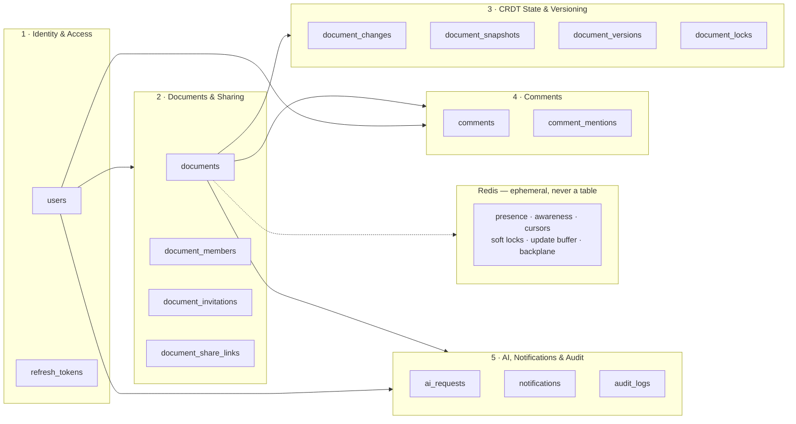
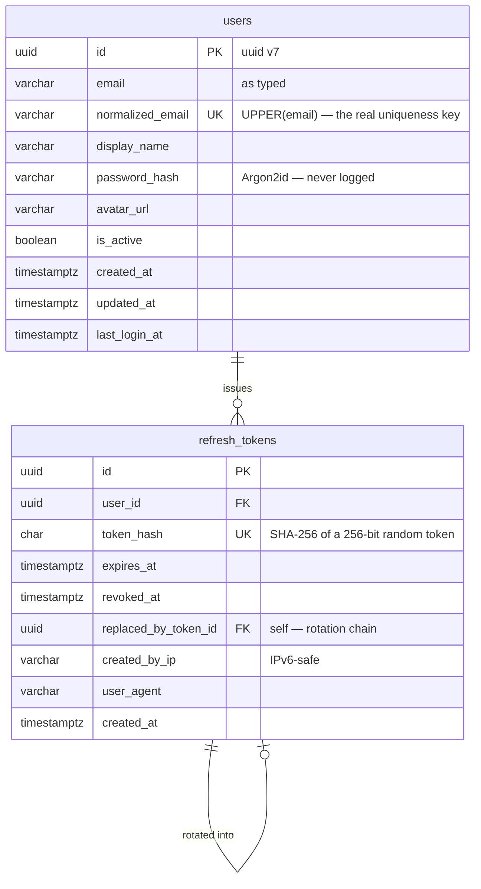
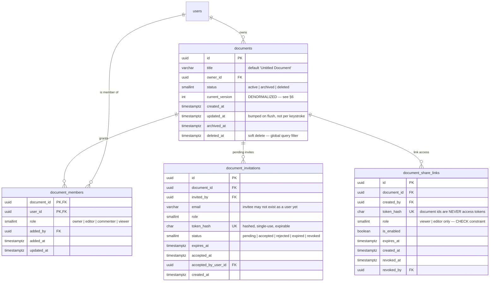
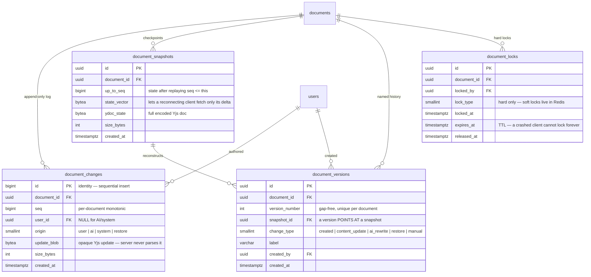
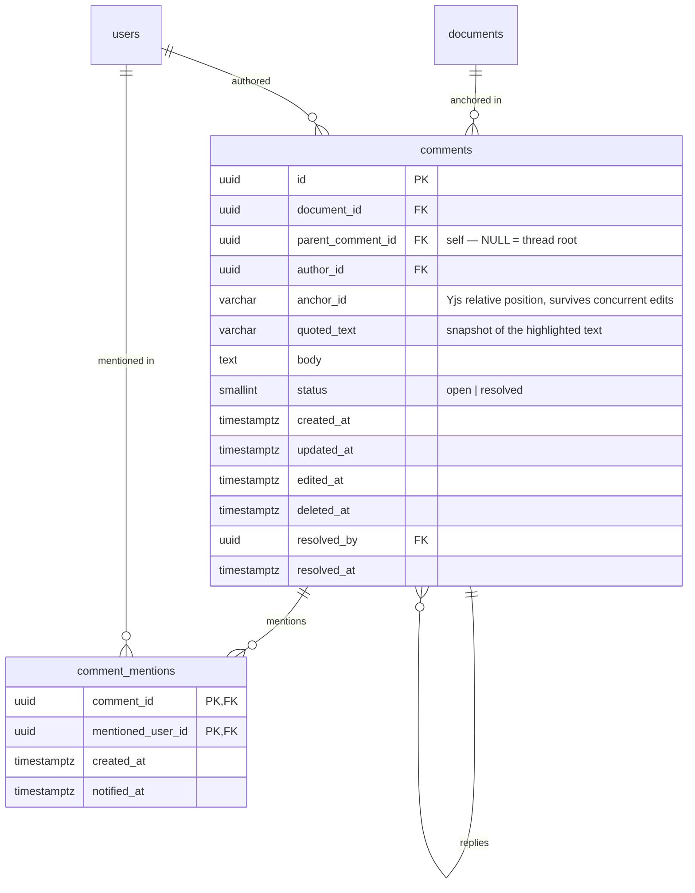
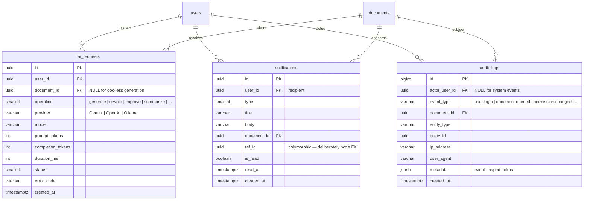

# SyncNote — Data Model / ERD

> **Canonical source:** [`syncnote.dbml`](./syncnote.dbml) — paste into [dbdiagram.io](https://dbdiagram.io/d) for the interactive, laid-out diagram with every column, index and note.
> **This file** is the same model as Mermaid (renders in GitHub, VS Code, Obsidian) plus the design rationale.

| | |
|---|---|
| Tables | 15 |
| MVP tables (PRD §52) | 12 — `document_locks`, `notifications`, `audit_logs` are post-MVP |
| Normal form | 3NF/BCNF throughout, with 3 documented denormalizations |
| Not in SQL | presence, awareness, cursors, soft locks, update buffer → Redis |

---

## 0. Module map

How the five clusters relate. Everything hangs off `users` and `documents`; nothing hangs off both in a way that duplicates either.



---

## 1. Identity & Access



**Why no `user_sessions` table** (PRD §36 lists it as optional): a live session *is* a live refresh-token row. A separate table would store the same fact twice and let the two drift. Connection-level session state belongs in Redis.

---

## 2. Documents & Sharing



**`document_members` has a natural composite PK `(document_id, user_id)`** — no surrogate `id`. A duplicate membership then cannot exist; the DB enforces what PRD §27 requires rather than a service method remembering to check. The reverse index `(user_id, document_id)` covers "Shared with me".

**Three access paths, three tables — on purpose.** They differ in cardinality and lifecycle, so merging them would produce a table where half the columns are always NULL:

| | targets | count | revocation |
|---|---|---|---|
| `document_members` | a known user id | one | delete the row |
| `document_invitations` | an email that may not have an account | one | expire / revoke the token |
| `document_share_links` | anyone holding the link | unbounded | flip `is_enabled` |

---

## 3. CRDT State, Snapshots & Versioning

This is the part that makes SyncNote a collaboration system rather than a CRUD app: **`documents` has no content column.** Content is an append-only log plus periodic snapshots.



**Read path — bounded, not O(history):**

```
load latest snapshot for doc          →  1 row
+ changes WHERE seq > snapshot.up_to_seq  →  a handful of rows
= current document state
```

Without snapshots, opening a document that has seen 50 000 edits would replay 50 000 rows. This is PRD §20 expressed as schema.

**A version is a pointer, not a copy.** `document_versions.snapshot_id` is a FK to the snapshot that already holds those bytes. Storing the content again per version would duplicate megabytes per document and violate 3NF (content would depend on the snapshot, not on the version key). Restore becomes: read the snapshot, apply it as a Yjs transaction, write a new `restore` version.

**Write path — one filtered unique index does the concurrency work:**
`ux_locks_one_active_per_doc` on `document_id WHERE released_at IS NULL` means the database, not application code, guarantees at most one live hard lock per document. `ux_document_changes_doc_seq` on `(document_id, seq)` means a duplicated flush cannot double-apply.

---

## 4. Comments & Mentions



**Deviation from PRD §36 — `CommentReplies` is merged into `comments`.** A reply has exactly the same attributes as a comment: author, body, timestamps, edit, delete, mentions. Two tables would duplicate every column *and* every rule (edit permission, soft delete, mention extraction) and force `UNION`-shaped queries to render one thread. One self-referencing table is the 3NF-correct shape; a `CHECK` keeps nesting to one level, matching the Google-Docs threading in PRD §22.

**`anchor_id` is a Yjs relative position, not a character offset.** An offset would silently point at the wrong text the moment a collaborator types above the comment — the whole failure mode CRDTs exist to prevent.

---

## 5. AI, Notifications & Audit



**`ai_requests` stores metadata only** — operation, model, token counts, latency, status. No prompt text, no document content. PRD §32 says the AI must not write to SQL; accepted output re-enters through a Yjs transaction like any human edit. The table exists for quota (`ix_ai_requests_quota` on `(user_id, created_at)`) and cost visibility.

**`notifications.ref_id` is intentionally not a foreign key.** It points at a comment, an invitation or a membership depending on `type`. A real FK would need one nullable column per target type; a check constraint per type buys nothing on a table that is only ever read by `user_id`.

**`audit_logs.metadata` is `jsonb` on purpose.** Audit rows are write-once, read rarely, and every new event type would otherwise add a column that is NULL for all previous rows. Structured columns cover what is actually queried (`actor`, `document`, `event_type`, `created_at`); the rest is payload.

---

## 6. Normalization ledger

Every table is in 3NF/BCNF. The exceptions are deliberate and listed here so they are reviewable rather than accidental.

| Normal form | Where it bites | Resolution |
|---|---|---|
| **1NF** | `@mentions` in a comment; roles per user per document | `comment_mentions` and `document_members` are rows, never delimited strings |
| **2NF** | `document_members(document_id, user_id)` | `role`, `added_by`, `added_at` depend on the *whole* key — no partial dependency |
| **3NF** | tempting to copy `owner_email` onto `documents`, or `document.title` onto `notifications` | never stored; joined at read time |
| **BCNF** | `token_hash` in tokens/invitations/links | each is a unique determinant with its own unique index |
| **4NF** | a comment has many mentions *and* many replies | independent multivalued facts live in independent tables |

### Accepted denormalizations (3, all bounded)

| Column | Derivable from | Why it stays | Drift risk |
|---|---|---|---|
| `documents.current_version` | `MAX(document_versions.version_number)` | dashboard lists N documents; an aggregate per row is N+1 | written in the same transaction as the version |
| `documents.owner_id` **and** an `owner` row in `document_members` | either one alone | one permission query (`document_members`) answers every check, and the owner survives as a first-class column for `ix_documents_owner_recent` | invariant enforced in `DocumentService.Create` + a test |
| `comments.quoted_text` | the live document text at `anchor_id` | the quoted text must keep reading correctly after the document moves on; it is a *historical snapshot*, not a cache | none — it is intentionally frozen |

### Rejected tables

| PRD name | Verdict |
|---|---|
| `CommentReplies` | merged into `comments` via `parent_comment_id` (§4) |
| `UserSessions` | a session is a live `refresh_tokens` row; connection state is Redis (§1) |
| `DocumentChanges` as the *only* content store | kept, but paired with `document_snapshots` so reads stay bounded (§3) |

---

## 7. Index strategy

Every index below exists because a specific screen or check needs it.

| Index | Serves |
|---|---|
| `documents (owner_id, updated_at DESC)` | Dashboard "My Documents" (PRD §8) |
| `documents (title)` trigram/full-text | Dashboard search |
| `document_members (user_id, document_id)` | "Shared with me" + every authorization check |
| `document_changes (document_id, seq)` UNIQUE | replay ordering; idempotent flush |
| `document_snapshots (document_id, up_to_seq)` UNIQUE | "latest snapshot for this doc" |
| `document_versions (document_id, version_number)` UNIQUE | gap-free numbering (PRD §18) |
| `document_locks (document_id) WHERE released_at IS NULL` | one live hard lock per document |
| `comments (document_id, status, created_at)` | open-threads sidebar |
| `notifications (user_id, is_read, created_at)` | unread badge in one index-only scan |
| `ai_requests (user_id, created_at)` | quota / rate-limit window |
| `*.token_hash` UNIQUE | O(1) token lookup without exposing raw tokens |

**Growth plan.** `document_changes` and `audit_logs` are the only tables that grow without bound. Both are append-only with a time-ordered key, so both partition cleanly (`document_changes` by `document_id`, `audit_logs` by `created_at` month). `document_changes` rows at or below the newest snapshot's `up_to_seq` are safe to prune by a background job.

---

## 8. What never becomes a table

PRD §14 and §38. If its lifetime is measured in seconds, it lives in Redis:

| Key | Type | Holds |
|---|---|---|
| `presence:doc:{documentId}` | HASH | userId → name, colour, activity, lastSeen |
| `awareness:doc:{documentId}` | HASH | cursor / selection payloads |
| `connections:user:{userId}` | SET | SignalR connection ids |
| `lock:soft:doc:{documentId}:{block}` | STRING + TTL | informational "Rahul is editing here" |
| `buffer:doc:{documentId}` | LIST | Yjs updates awaiting the debounced flush |
| SignalR backplane channels | pub/sub | horizontal scale-out |

Writing presence to SQL would mean a write per cursor move per user — the exact anti-pattern PRD §16 forbids.

---

## 9. Open decision — SQL Server vs PostgreSQL

The PRD and `tasks.server.json` say **SQL Server**; `appsettings.Development.json` is configured for **PostgreSQL** (`Host=localhost;Port=5432;Database=SyncNote`). The model above is written provider-neutral and works on both — only these types differ:

| Concept | PostgreSQL | SQL Server |
|---|---|---|
| Timestamp | `timestamptz` | `datetimeoffset(7)` |
| CRDT blob | `bytea` | `varbinary(max)` |
| Audit metadata | `jsonb` | `nvarchar(max)` |
| Boolean | `boolean` | `bit` |
| Filtered unique index | `CREATE UNIQUE INDEX … WHERE …` | `CREATE UNIQUE INDEX … WHERE …` (same) |
| Title search | `pg_trgm` GIN index | Full-Text Index |

The connection string is the newer artifact, so **PostgreSQL is the assumed target** unless you say otherwise. It changes the EF provider package and a handful of `HasColumnType` calls, nothing structural.

---

## 10. How to view this

```bash
# interactive, best layout — paste docs/erd/syncnote.dbml
open https://dbdiagram.io/d

# or generate SQL / a PNG locally
npx -y @dbml/cli syncnote.dbml --postgres -o schema.sql
```

Mermaid blocks in this file render natively on GitHub and in VS Code (*Markdown Preview Mermaid Support*).
